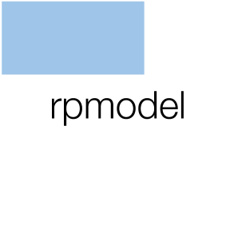

[](https://ci.appveyor.com/project/stineb/rpmodel)
<a href="https://www.buymeacoffee.com/H2wlgqCLO" target="_blank"></a>
[]()

<script type="text/javascript"
        src="https://cdnjs.cloudflare.com/ajax/libs/mathjax/2.7.0/MathJax.js?config=TeX-AMS_CHTML"></script>

# 

## Purpose

`rpmodel` provides an implementation of the P-model (Prentice et al., 2014; Wang et al., 2017; Stocker et al., 2019) for predicting acclimated photosynthetic parameters, assimilation, and dark respiration rates as a function of the environment. The main function is `rpmodel()` which returns a list of variables that are mutually consistent within the theory of the P-model (see [Theory](./articles/theory.html) ). Further functions used within `rpmodel()` are also provided through the package.

## Usage

This loads the `rpmodel` package and executes the `rpmodel()` function without $J_{\text{max}}$ limitation (argument `method_jmaxlim = "none"`), and with a temperature-independent quantum yield efficiency (argument `do_ftemp_kphio = FALSE`):
```{r, message=FALSE, warning=FALSE, eval=FALSE}
library(rpmodel)
out_pmodel <- rpmodel( 
  tc             = 20,           # temperature, deg C
  vpd            = 1000,         # Pa,
  co2            = 400,          # ppm,
  elv            = 0,            # m.a.s.l.,
  kphio          = 0.05,         # quantum yield efficiency,
  beta           = 146,          # unit cost ratio a/b,
  fapar          = 1,            # fraction  ,
  ppfd           = 300,          # mol/m2/d,
  method_optci   = "prentice14",
  method_jmaxlim = "none",
  do_ftemp_kphio = FALSE 
  )
```

For more information and examples see [Get Started](./articles/rpmodel.html).

## Installation

### Development release
To install and load the rpmodel package (development release) run the following command in your R terminal: 
```{r eval=FALSE}
if(!require(devtools)){install.packages(devtools)}
devtools::install_github( "stineb/rpmodel", build_vignettes = TRUE )
library(rpmodel)
```

### Stable release
`rpmodel` is not yet available on CRAN. We're working on it.


## References

Stocker, B. D., Wang, H., Smith, N. G., Harrison, S. P., Keenan, T. F., Sandoval, D., Davis, T., and Prentice, I. C.: P-model v1.0: An optimality-based light use efficiency model for simulating ecosystem gross primary production, Geosci. Model Dev. Discuss., https://doi.org/10.5194/gmd-2019-200, in review, 2019.

Wang, H., Prentice, I. C., Keenan, T. F., Davis, T. W., Wright, I. J., Cornwell, W. K.,Evans, B. J., and Peng, C.:  Towards a universal model for carbon dioxide uptake byplants, Nat Plants, 3, 734–741, 2017.

Prentice,  I. C.,  Dong,  N.,  Gleason,  S. M.,  Maire,  V.,  and Wright,  I. J.:  Balancingthe costs of carbon gain and water transport:  testing a new theoretical frameworkfor  plant  functional  ecology, Ecology  Letters,  17,  82–91, 10.1111/ele.12211, http://dx.doi.org/10.1111/ele.12211, 2014.


## Acknowledgement

This project was funded by ERC Marie Sklodowska-Curie fellowship H2020-MSCA-IF-2015, project FIBER, grant number 701329.
