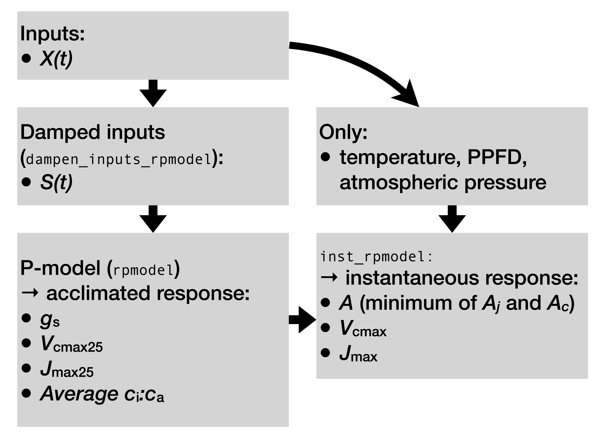

## Motivation

The P-model predicts the "acclimated" response of photosynthetic parameters (Vcmax, Jmax, "average" ci:ca) to the environment and reflects the acclimation process by balanced investments to maintaining the photosynthetic apparatus and transpiration stream (essentially a trade-off between the capacities of light-harvesting and dark reactions on the one hand and stomatal aperture on the other hand). Irrespective of investments into the different photosynthetic capacities, there is an instantaneous response of different rates that are governed by enzymatic processes or simple physics. This means that the P-model (the results returned by a `rpmodel()` function call) doesn't predict instantaneous response, but only the more slowly acclimating responses. However, the instantaneous rates are sometimes more relevant to consider, e.g., for comparison to observations. Using the same underlying principles and parametrisations as used in the P-model, we can calculate the instantaneous response from instantaneous environmental conditions and the acclimated resposne from the P-model.

In order to make this separation of the acclimated and instantaneous response more explicit, two functions are introduced:

1. `dampen_vec`: Applies an exponential dampening with a specified time scale to all inputs (environmental variables) to which photosynthesis acclimates.
2. `inst_rpmodel`: Calculates instantaneous responses from outputs of `rpmodel()`.

{width=50%}

This explicit separateion allows for a clear application of the P-model to time series data which is given at a temporal resolution that is higher than the typical acclimation time scale. The following example illustrates such an application.

## Example

We first create a data frame of daily inputs $X(t)$ for one year. This is some syntetic data with a seasonality.
```{r}
library(dplyr)
library(ggplot2)

df <- tibble(doy = 1:365) %>% 
  mutate(
    tc     = 30 * (sin(doy*pi/(365)))^2 + rnorm(365, mean = 0, sd = 5),
    vpd    = 1000 + rnorm(365, mean = 0, sd = 50),
    co2    = rep(400, 365),
    fapar  = rep(1, 365),
    ppfd   = 250 * (sin(doy*pi/(365)))^2 + 50
  )

df %>%
  ggplot(aes(doy, tc)) + geom_line()
df %>%
  ggplot(aes(doy, ppfd)) + geom_line()
```

Next, calculated temporally damped input time series. This can be done with the function `dampen_vec` (newly added for rpmodel package version 1.2).
```{r}
library(rpmodel)
df_damped <- df %>% 
  mutate_at(vars(one_of(c("tc", "vpd", "co2", "fapar", "ppfd"))), dampen_vec, tau = 40)

ggplot() + 
  geom_line(data = df, aes(doy, tc)) +
  geom_line(data = df_damped, aes(doy, tc), color = "red")
```

Now, we can apply the P-model to the damped time series.
```{r}
library(purrr)
library(tidyr)

df_out <- df_damped %>%
  mutate( out_pmodel = purrr::pmap(dplyr::select(., -doy), rpmodel, 
    elv            = 0,         
    kphio          = 0.05,         
    beta           = 146,
    c4             = FALSE,
    method_optci   = "prentice14",
    method_jmaxlim = "wang17",
    do_ftemp_kphio = FALSE
    ) )
```

```{r echo=FALSE}
df_out %>% 
  mutate( out_pmodel = purrr::map(out_pmodel, ~as_tibble(.))) %>% 
  unnest(out_pmodel) %>% 
  pivot_longer(cols = c(vcmax, vcmax25), names_to = "Variable", values_to = "Vcmax") %>% 
  ggplot() +
  geom_line(aes(doy, Vcmax, color = Variable))
```

Using the acclimated quantities, we can now calculate daily instantaneous rates using the same underlying parametrisations (for assimilation, etc.)
```{r}
df_out <- df %>% 
  left_join(dplyr::select(df_out, doy, out_pmodel), by = "doy") %>% 
  mutate(out_inst = purrr::pmap(dplyr::select(., x = out_pmodel, tc, vpd, co2, fapar, ppfd), 
                                inst_rpmodel,
                                elv = 0, 
                                kphio = 0.05))
```

```{r echo=FALSE}
df_out <- df_out %>% 
  mutate( out_pmodel = purrr::map(out_pmodel, ~as_tibble(.)),
          out_inst = purrr::map(out_inst, ~as_tibble(.))) %>% 
  unnest(out_inst) %>% 
  rename(vcmax_inst = vcmax, jmax_inst = jmax, assim_inst = assim, gpp_inst = gpp, ci_inst = ci, rd_inst = rd) %>% 
  unnest(out_pmodel) %>% 
  rename(vcmax_acclim = vcmax, jmax_acclim = jmax, gpp_acclim = gpp, ci_acclim = ci, rd_acclim = rd)

df_out %>% 
  rename(Hypothetical_instantaneously_acclimated = gpp_acclim, Actual_instantaneous = gpp_inst) %>% 
  pivot_longer(cols = c(Actual_instantaneous, Hypothetical_instantaneously_acclimated), names_to = "Type", values_to = "GPP") %>% 
  ggplot() +
  geom_line(aes(doy, GPP, color = Type)) +
  labs(title = "GPP")

df_out %>% 
  rename(light_limited = a_j, rubisco_limited = a_c) %>% 
  pivot_longer(cols = c(light_limited, rubisco_limited), names_to = "Limitation", values_to = "Assimilation") %>% 
  ggplot() +
  geom_line(aes(doy, Assimilation, color = Limitation)) +
  labs(title = "Assimilation")
```
